# Инструкция по установке Autocom 2020.23 📝

## Введение 🛠️

Мы разработали данную инструкцию, чтобы обеспечить максимальный комфорт и успешность в установке приложения. Чтобы избежать возможных проблем, пожалуйста, внимательно следуйте всем пунктам инструкции.

## Отключение антивирусов 🔧

Отключите все антивирусы, в том числе и стандартный Защитник Windows. Мы неоднократно проверяли все файлы - они не содержат никаких вирусов. Вы можете убедиться в этом, например, скачав, на наш взгляд, достойный антивирус Dr.Web и проверить все файлы программы на вирусы, и вы убедитесь в их отсутствии.

### Отключение стандартного Защитника Windows

**Что нужно:** зайдите в Параметры, далее зайдите в Безопасность Windows и отключите ползунки так, как показано на скриншоте. Если у вас есть сторонние антивирусы, то их тоже нужно отключить.

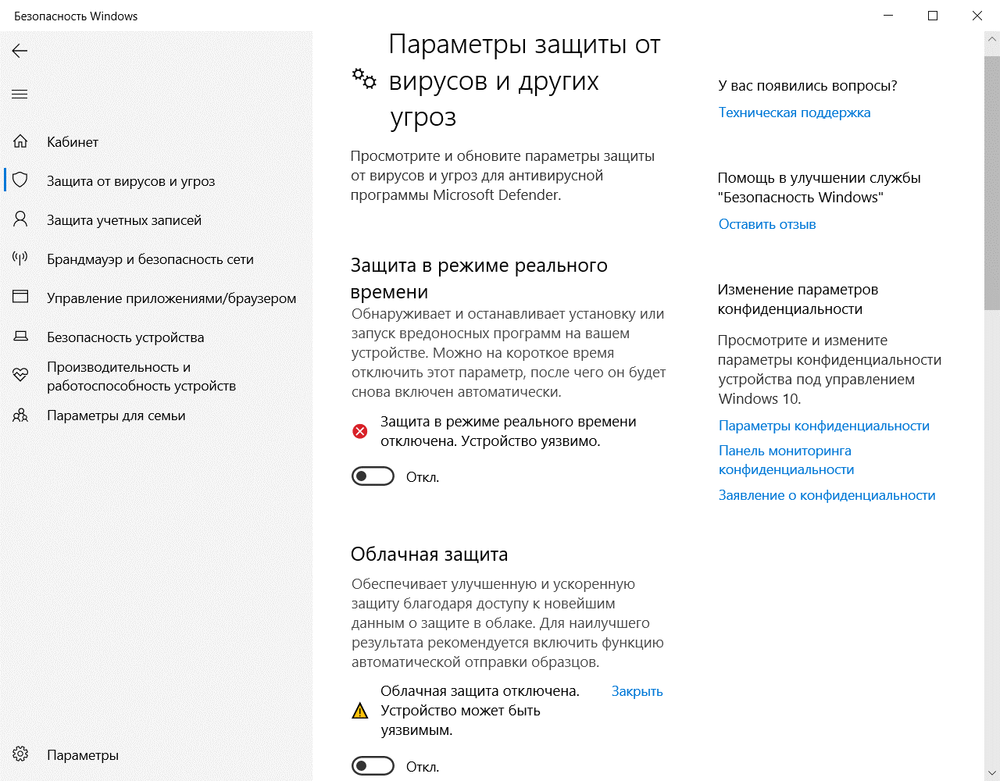

## Отключение брандмауэра 🔒

На время установки следует отключить брандмауэр Защитника Windows.

**Что нужно:** открыть Панель управления, далее открыть Брандмауэр Защитника Windows и сделать все, как ниже на скриншоте и нажать Ok.

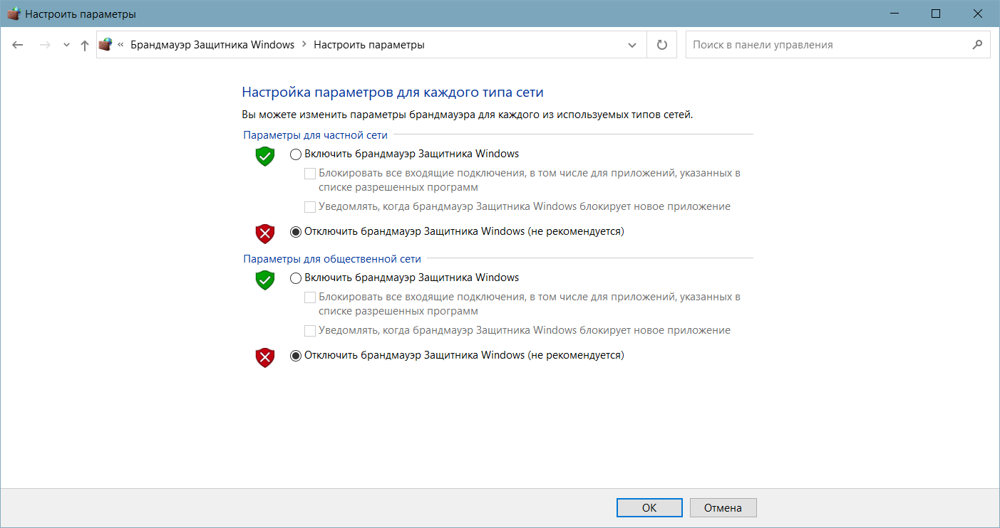

## Установка программы 💻

1. Загрузите архив и после завершения загрузки распакуйте его. Если при открытии архива или попытке распаковки возникает ошибка, рекомендуем убедиться, что архив был полностью загружен. (Иногда такие ошибки могут возникать из-за встроенного антивируса в Яндекс.Браузере, поэтому стоит также временно отключить его. Это можно сделать, перейдя в «настройки браузера», затем в раздел «безопасность» и убрав галочку с опции «Проверять безопасность посещаемых сайтов и загружаемых файлов». После этого, попробуйте снова открыть архив и распаковать его.)

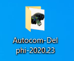

2. Запускаем файл установки **Autocom-Delphi-2020.23.exe**.

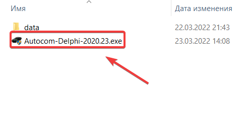

3. Нажмите **Next**.

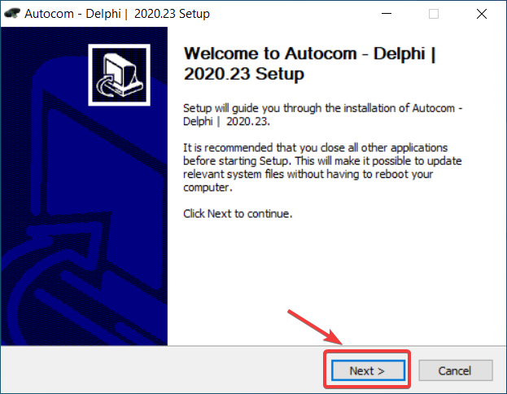

4. Выбираем **Autocom**.

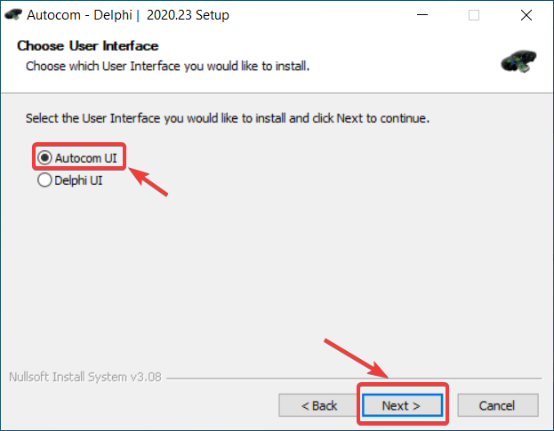

5. Если у вас двухплатный сканер или вы не знаете какой, то выбираем пункт **Firmware 1622**. Если у вас одноплатный сканер, то выбираем **Firmware 3201**.

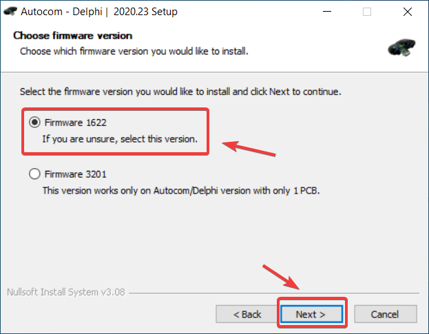

6. Выбираем путь для установки программы (Менять не рекомендуется).

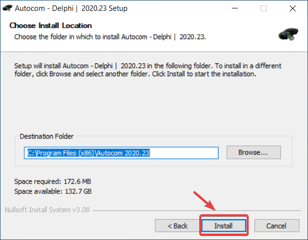

7. Во время установки появится окно для установки вспомогательных утилит/драйверов, жмем **Далее**.

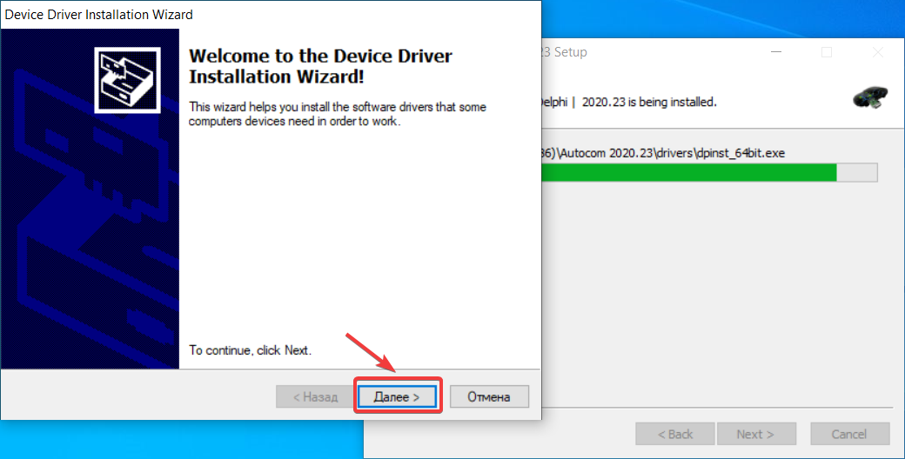

8. В конце установки жмем **Next** и затем **Finish**.

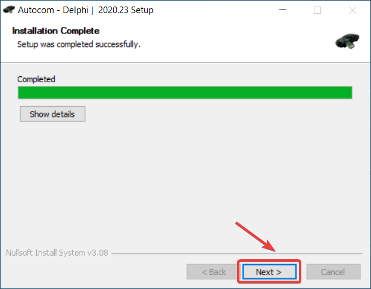 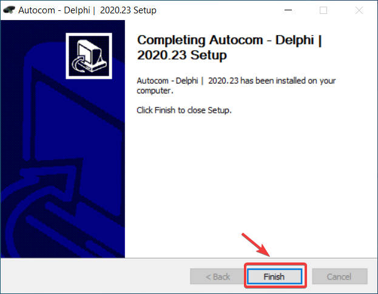

9. Для обеспечения работы программы, пожалуйста, добавьте папку с установленным приложением в список исключений вашего антивируса (если у вас установлен антивирус) и в список исключений Защитника Windows. Этот шаг крайне важен, иначе после первого запуска программа может быть автоматически удалена антивирусом. Заметьте, стандартный антивирус Защитника Windows имеет свойство самостоятельного включения и может активироваться в любой момент. Если папка с программой не будет включена в список исключений, программа рискует быть удалена.

## Активация программы 🔑

1. Запускаем активатор с ярлыка на рабочем столе и ждем его открытия.

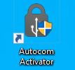 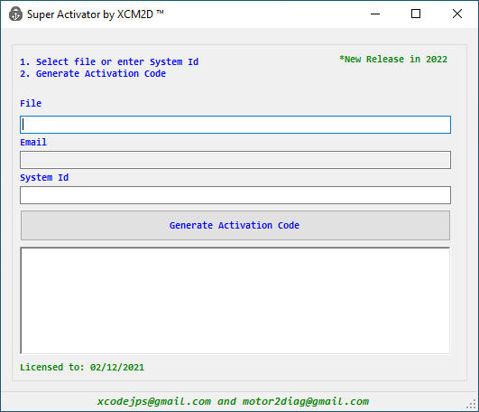

2. Запускаем программу через ярлык на рабочем столе.

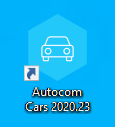

3. Вводим любой e-mail и жмем **Next**.

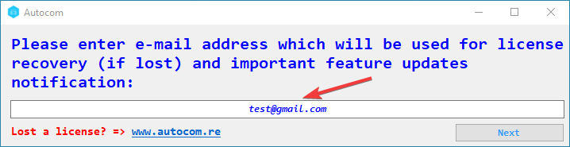

4. Копируем данный Идентификатор.

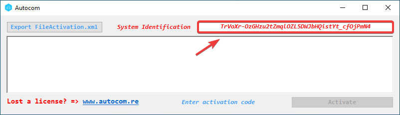

5. Вставляем скопированный идентификатор в строку **System ID** в активаторе и жмем **Generate Activation Code**.

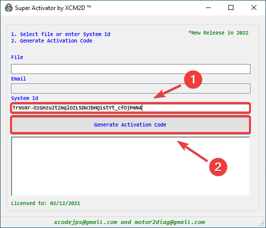

6. Копируем полученный код, вставляем его в программу и жмем **Activate**. (CTRL+C - копировать, CTRL+V - вставить)

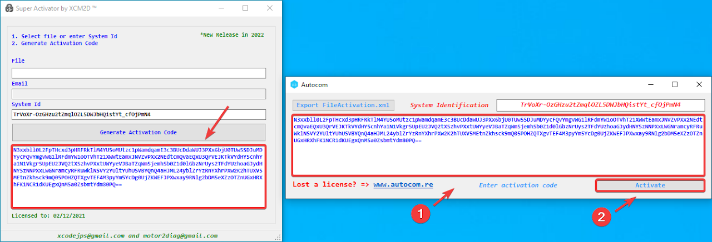

## Смена языка в программе 🌐

1. После запуска программы нажимаем **Settings**.

2. Выбираем и нажимаем на пункт **Language**.

3. Выбираем нужный язык и нажимаем **OK**.

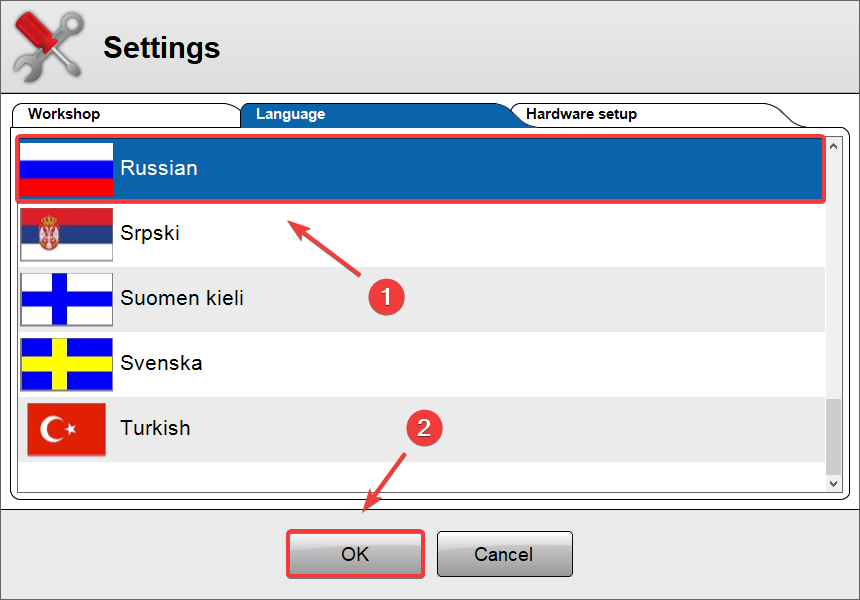

## Первое подключение 🔌

1. В программе нажимаем **Настройки** и далее **Установки оборудования**.

2. Для обновления прибора необходимо сначала подключить его к разъему **OBD**, затем нажать кнопку **Тест**, а после этого нажать кнопку **Обновить** и дождаться окончания процесса обновления. Если прибор не будет подключен к разъему OBD, то после нажатия кнопки Тест будет выведено сообщение об ошибке: **Тест: Ошибка**.

