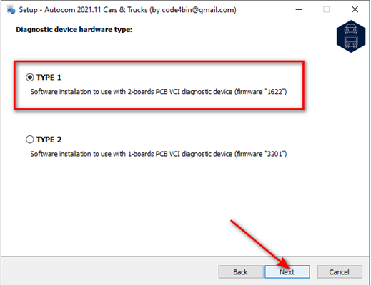
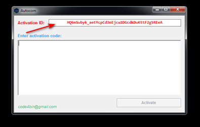
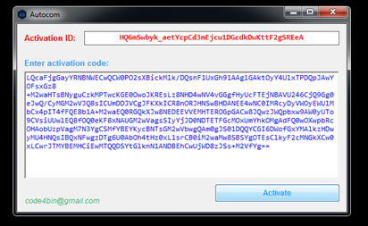
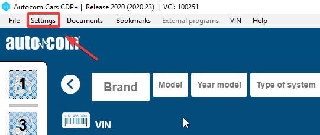
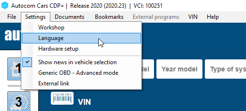
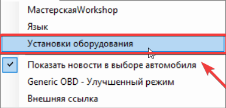
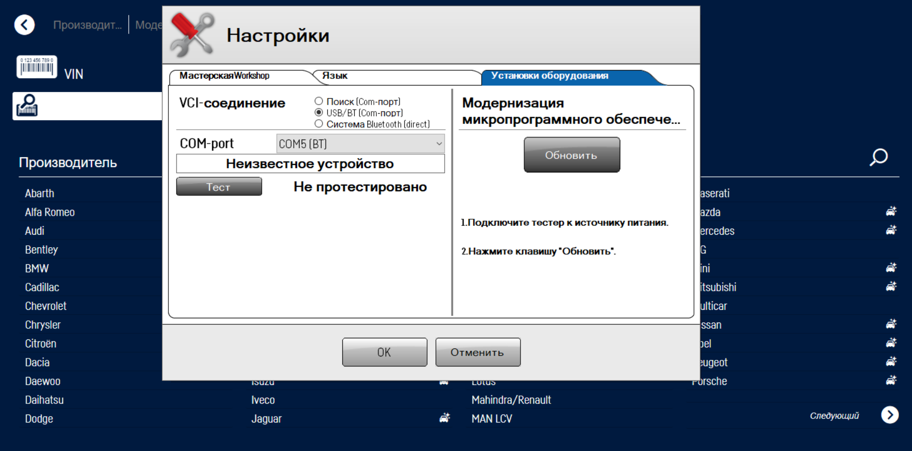

# Инструкция по установке Autocom 2021.11 📝

## Введение 🛠️

Мы разработали данную инструкцию, чтобы обеспечить максимальный комфорт и успешность в установке приложения. Чтобы избежать возможных проблем, пожалуйста, внимательно следуйте всем пунктам инструкции.

## Отключение антивирусов 🔧

Отключите все антивирусы, в том числе и стандартный Защитник Windows. Мы неоднократно проверяли все файлы - они не содержат никаких вирусов. Вы можете убедиться в этом, например, скачав, на наш взгляд, достойный антивирус Dr.Web и проверить все файлы программы на вирусы, и вы убедитесь в их отсутствии.

### Отключение стандартного Защитника Windows

**Что нужно:** зайдите в Параметры, далее зайдите в Безопасность Windows и отключите ползунки так, как показано на скриншоте. Если у вас есть сторонние антивирусы, то их тоже нужно отключить.


## Отключение брандмауэра 🔒

На время установки следует отключить брандмауэр Защитника Windows.

**Что нужно:** открыть Панель управления, далее открыть Брандмауэр Защитника Windows и сделать все, как ниже на скриншоте и нажать Ok.


## Установка программы 💻

1. Загрузите архив с названием **Autocom 2021.11.rar** и после завершения загрузки распакуйте его. Если при открытии архива или попытке распаковки возникает ошибка, рекомендуем убедиться, что архив был полностью загружен. (Иногда такие ошибки могут возникать из-за встроенного антивируса в Яндекс.Браузере, поэтому стоит также временно отключить его. Это можно сделать, перейдя в «настройки браузера», затем в раздел «безопасность» и убрав галочку с опции «Проверять безопасность посещаемых сайтов и загружаемых файлов». После этого, попробуйте снова открыть архив и распаковать его.)
2. Запустите файл установки.
3. Нажмите **Next**.
4. Введите пароль: 
```
**NewSoftware2021**
```
и нажмите **Next**.
5. Нажмите **Next**.
6. Выберите путь установки.
7. Выберите тип вашего прибора. Если у вас версия прибора с двумя платами или если вы не знаете вариацию вашего прибора, выберите **Type 1**. Если у вас **ОДНОПЛАТНЫЙ** прибор, выберите **Type 2** и нажмите **Next**. Этот шаг крайне важен при выборе. Помните, что неправильный выбор типа при установке и последующей перепрошивке может привести к неработоспособности прибора.



8. Нажмите **Next**.
9. Оставьте отмеченным пункт **'Создать ярлыки на рабочем столе'**, затем нажмите **Next** и далее **Install**. По завершении установки, вам будет предложено установить драйверы для устройства и дополнительные файлы - необходимо выполнить установку. Если установочные файлы дополнительных программ сообщат, что данные программы уже установлены на вашем компьютере и предложат их модифицировать/обновить, пожалуйста, согласитесь.
:::caution Внимание
10. Для обеспечения работы программы, пожалуйста, добавьте папку с установленным приложением в список исключений вашего антивируса (если у вас установлен антивирус) и в список исключений Защитника Windows. Этот шаг крайне важен, иначе после первого запуска программа может быть автоматически удалена антивирусом. Заметьте, стандартный антивирус Защитника Windows имеет свойство самостоятельного включения и может активироваться в любой момент. Если папка с программой не будет включена в список исключений, программа рискует быть удалена.


:::
11. Запустите программу, щелкнув на ярлыке на рабочем столе. Появится окно с запросом **Activation ID**. Пожалуйста, скопируйте это сообщение и отправьте его нам для получения ключа активации. Чтобы связаться с нами, воспользуйтесь удобным для вас способом: через онлайн-чат на нашем сайте, [Telegram-бота](https://смартдиаг-поддержка.рф/telegram), [WhatsApp](https://смартдиаг-поддержка.рф/whatsapp) или заполните форму обратной связи по [ссылке](https://смартдиаг.рф/contact), выбрав тему "активация прибора". Не забудьте указать номер вашего заказа и ваш **Activation ID**.



Мы постараемся ответить вам в течение от 1 минуты до 12 часов, в зависимости от выбранного способа связи и загруженности наших операторов.

:::caution Внимание
Обратите внимание, что в сети интернет появился "активатор" для версии 2021.11. Наша техническая поддержка провела полное исследование и обнаружила, что данный активатор содержит вредоносное ПО (данный активатор, после запуска, автоматически добавляет два сертификата на ваш компьютер для удаленного доступа и открывает РНР скрипт для переадресации на рекламный сайт). Во избежание проблем, мы рекомендуем отказаться от использования этого активатора. Мы следуем "Уголовному кодексу Российской Федерации" от 13.06.1996 N 63-ФЗ (ред. от 31.07.2023) УК РФ Статья 273, и поэтому активируем программу каждого покупателя через запрос, гарантируя безопасность и надежность.
:::

:::tip Совет
Версию программы 2020.23 из соседней папки, вы можете активировать самостоятельно. Наша команда провела полную проверку дистрибутива программы и активатора, и мы можем заверить вас, что они безопасны для вашего компьютера.
:::

12. После получения ключа активации, скопируйте его (**CTRL+C** - копировать) и вставьте (**CRTL+V** - вставить) в программу. Затем, нажмите кнопку **Activate**. Обязательно используйте указанные комбинации клавиш для копирования и вставки ключа, учитывая особенности программы. Иначе, вам не удастся вставить ключ в окно активации программы.



## Смена языка в программе 🌐

1. После запуска программы нажимаем **Settings**.



2. Выбираем и нажимаем на пункт **Language**.



3. Выбираем нужный язык и нажимаем **OK**.


## Первое подключение 🔌

1. В программе нажимаем **Настройки** и далее **Установки оборудования**.



2. Для обновления прибора необходимо сначала подключить его к разъему **OBD**, затем нажать кнопку **Тест**, а после этого нажать кнопку **Обновить** и дождаться окончания процесса обновления. Если прибор не будет подключен к разъему OBD, то после нажатия кнопки Тест будет выведено сообщение об ошибке **Тест: Ошибка**.


