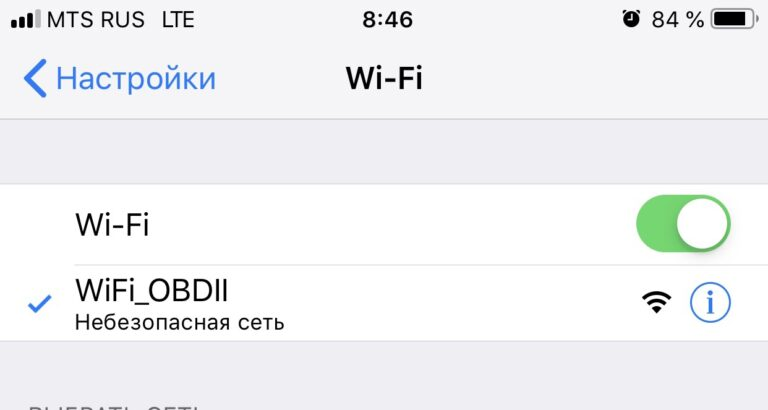
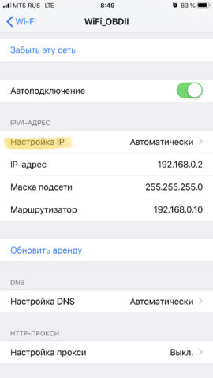
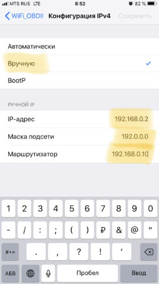

# Решение проблем с подключением к Wi-Fi адаптерам на iOS 📱

## Основные моменты 🔍

Прежде всего, вы должны понять и принять три простых вещи:

1. **Поддержка всех версий iOS**: Car Scanner поддерживает все версии iOS, включая самые последние. Неважно, у вас iOS 13, 14, 15 или даже 100500. Car Scanner всегда обновляется для поддержки последних версий iOS. ELM327 использует простое и примитивное соединение TCP/IP, на которое обычно не влияет обновление версии iOS.

2. **Подключение к Wi-Fi сети адаптера**: Устройство ELM327 с типом подключения Wi-Fi выдает себя за точку доступа Wi-Fi и создает сеть Wi-Fi, к которой необходимо подключиться с помощью настроек iOS. Вы должны сначала подключиться к сети Wi-Fi OBDII адаптера в настройках iOS, и только потом пытаться подключиться в Car Scanner. Эта сеть обычно носит название «OBDII WiFi» или «WiFi OBD2» или что-то в этом роде. Она никогда не называется так, как ваша домашняя сеть (например, «Keenetic-1234», «MyHOME» и т.д.) или как марка вашего автомобиля (например, «Ford», «Skoda», «Audi» и т.д.). Пожалуйста, не будьте тем человеком, который подключился к своей домашней сети и возмущается, почему он не может подключиться к адаптеру.

3. **Особенности iOS**: Когда вы подключаетесь к точке доступа OBDII Wi-Fi, iOS не знает, что вы подключаетесь к диагностическому адаптеру и ожидает увидеть там нормальную сеть Wi-Fi с доступом в Интернет. iOS может подключиться к сети Wi-Fi ELM327/OBDII, не обнаружить там доступа в Интернет, и включить «волшебство iOS»: показать пользователю в настройках, что iPhone/iPad подключен к сети Wi-Fi, но фактически не использует эту сеть. Это очень важно! Вы увидите в настройках iOS, что сеть Wi-Fi подключена (отмечена галочкой), но вы не увидите значок Wi-Fi на верхней панели. Это часто происходит с iOS 14 и выше (да, iOS 15 выше, чем iOS 14). В этом случае вам следует установить настройки сети Wi-Fi вручную (читайте пункт №4 ниже).

## Частые причины проблем и их решения 🛠️

### 1. iPhone/iPad не подключен к сети Wi-Fi ELM327 OBDII

**Решение**: Перейдите в **«Настройки iOS» -> «Wi-Fi»** и подключитесь к сети, которая называется «OBDII WiFi» или чем-то подобным.

### 2. Устройство ELM327 не отвечает

**Возможная причина №1**: Программный баг в устройстве, из-за которого оно зависает (очень часто бывает с дешевыми клонами ELM327).

**Решение**: Вытащите ELM327 из разъема и снова вставьте. Перейдите в настройки iOS -> Wi-Fi, чтобы повторно подключиться к сети Wi-Fi OBDII, и подключитесь снова в Car Scanner.

**Возможная причина №2**: Неисправно устройство ELM327. Многие пользователи задают вопросы в стиле «Вчера я успешно подключился, но не могу этого сделать сегодня! Что не так с приложением?!» К сожалению, проблема не в приложении. Китайские клоны ELM327 довольно часто и неожиданно «умирают», т.е. просто перестают работать, подключаться и т.д. Некоторые могут работать год, некоторые — 1 раз. Никогда не знаешь, поэтому аргументы в стиле «да я его только вчера купил» пожалуйста оставьте при себе. Кто хочет подробностей — вскрывайте адаптер и разбирайтесь, что именно там отвалилось или отгорело. Возможно, с помощью магазина радиодеталей и паяльника, вы сможете его починить.

**Решение**: Заменить ELM327. Прочтите, пожалуйста, мое руководство, как купить хорошее устройство ELM327.

### 3. Адаптер ELM327 занят другим приложением или устройством

Адаптер ELM327 не может использоваться несколькими приложениями или устройствами одновременно. Даже 2 устройства, просто подключенных к одной и той же сети OBDII Wi-Fi, могут вызвать проблему, когда одно из них или даже оба устройства не смогут подключиться.

**Решение**: Убедитесь, что любые другие устройства поблизости не подключены к той же сети OBDII Wi-Fi, и принудительно закройте все другие приложения OBDII.

### 4. iOS показывает подключение к сети Wi-Fi, но фактически не использует ее

В этом случае вы увидите, что сеть отмечена в настройках Wi-Fi iOS, но вы не увидите значок Wi-Fi в верхней части экрана.

**Решение**: Перейдите в **Настройки iOS -> Wi-Fi -> Нажмите на символ «i»** в кружочке рядом с названием сети Wi-Fi.

В разделе **IPV4** измените нажмите на **«Настройка IP»**:

- Вместо **«Автоматически»** выберите **«Вручную»** и задайте такие параметры:
  - **IP-адрес**: 192.168.0.2
  - **Маска подсети**: 192.0.0.0
  - **Маршрутизатор**: 192.168.0.10

После этого нажмите **«Сохранить»** и выйдите назад.

### 5. Неправильные настройки подключения в Car Scanner

Некоторые пользователи думают, что им следует указать в настройках подключения в Car Scanner IP-адрес iPhone/iPad, который они нашли в настройках Wi-Fi iOS, но это ошибка. Вы должны указать IP-адрес вашего устройства ELM327. В большинстве случаев это 192.168.0.10 (установлено по умолчанию) с портом 35000. Не изменяйте эти настройки, если вы не знаете абсолютно точно, что у вашего адаптера другой IP-адрес или порт.

### 6. Отсутствует разрешение на доступ к локальной сети в настройках iOS

Когда вы впервые пытаетесь подключиться к устройству Wi-Fi ELM327, iOS спросит вас, согласны ли вы предоставить Car Scanner доступ к локальной сети (обнаружение устройств и т.д.). Вы должны разрешить это. Если вы не разрешите доступ к локальной сети, iOS не позволит Car Scanner подключиться к ELM327 по Wi-Fi.

Чтобы проверить, предоставили ли вы разрешение на использование локальной сети, перейдите в **Настройки iOS -> Конфиденциальность -> Локальная сеть** и убедитесь, что вы видите там Car Scanner и что он включен.

Обратите внимание, что Car Scanner не появится в настройках iOS, пока вы не попытаетесь установить соединение в первый раз, будучи подключенным к сети Wi-Fi. Если вы не подключены к сети Wi-Fi, сообщение с запросом разрешения не появится и Car Scanner не появится в разделе **«Локальная сеть»**. Это разрешение требуется только для iOS 14 и выше (iOS 15, iOS 16 и так далее до конца времен).
