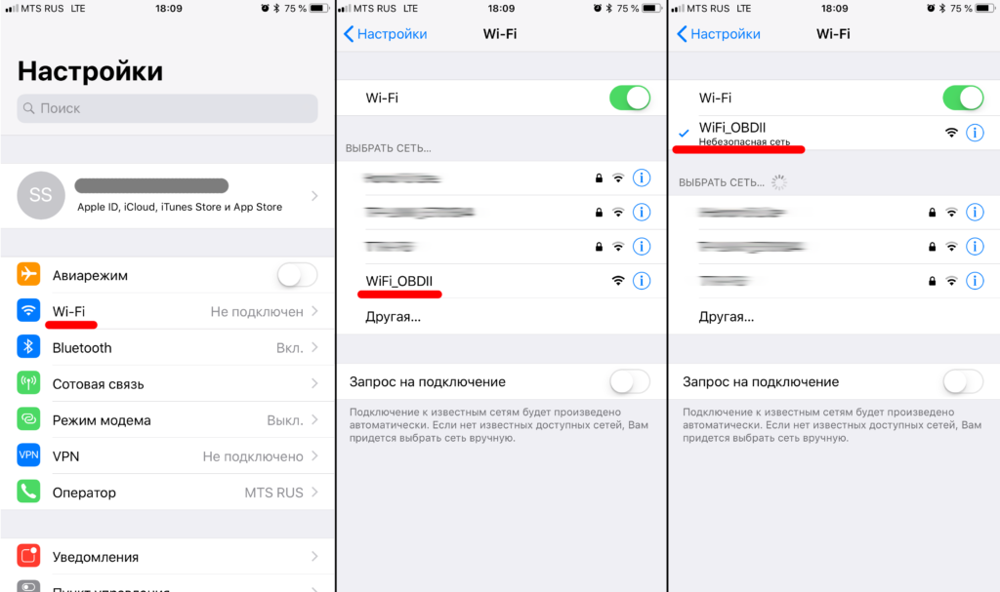
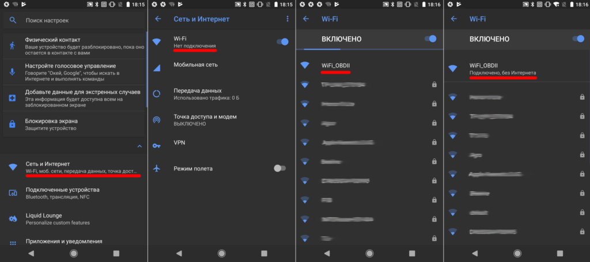
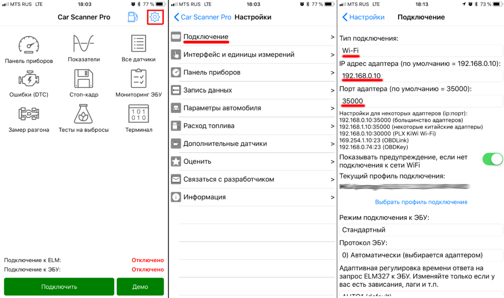
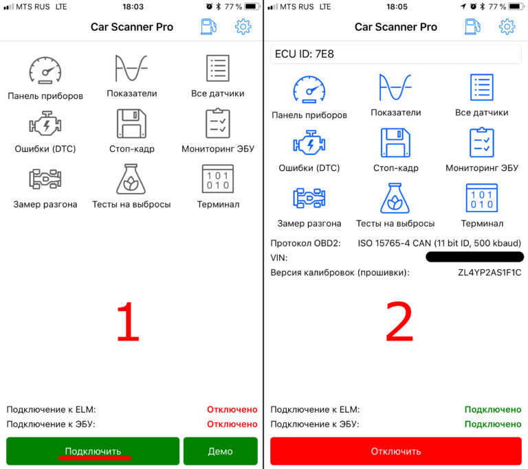

# Настройка подключения к Wi-Fi адаптеру ELM327 📡

## Подготовка к подключению 🔧

:::note Примечание:
Для начала, убедитесь, что у вас есть адаптер OBDII ELM327 с типом подключения Wi-Fi.
:::

1. Вставьте адаптер в диагностический разъем (также известный как разъем OBD2).
2. Включите зажигание или запустите двигатель.
3. Если у вашего адаптера на корпусе есть кнопка включения — нажмите ее.

## Шаг №1: Подключение к Wi-Fi сети адаптера 📶

1. Перейдите в **Настройки** вашего телефона или планшета и включите Wi-Fi.
2. Дождитесь обнаружения Wi-Fi сети, которую создал ваш адаптер, и подключитесь к ней. Обычно ее название “OBDII”, “OBD2”, “WIFI_OBDII” или что-то в этом роде. У брендовых адаптеров название сети может быть схоже с брендом адаптера (например, у адаптеров VGate сеть обычно называется VLINK).
3. Большинство адаптеров не требуют пароля, но если ваш требует — вы можете найти его в документации, которая идет с адаптером, на его упаковке или в его описании на сайте продавца.

### iOS 🍎 

### Android 🤖 

## Шаг №2: Настройка Car Scanner 🛠️

1. Запустите Car Scanner и откройте настройки (нажмите на иконку шестеренки в правом верхнем углу).
2. Выберите раздел **«Адаптер»** (в старых версиях — **«Подключение»**).
3. Выберите **«Тип подключения»: Wi-Fi**.
4. Убедитесь, что у вас введен правильный IP адрес адаптера и порт. Для большинства китайских адаптеров правильный адрес 192.168.0.10 и порт 35000. Узнать правильный адрес и порт вашего адаптера вы можете в документации, которая идет с адаптером, на его упаковке или в его описании на сайте продавца.

## Завершение настройки ✅

Вот и все, настройка подключения завершена. Теперь вам нужно просто нажать на большую зеленую кнопку **«Подключить»** на главном экране программы.

## Повторное подключение 🔄

В следующий раз вам нужно лишь убедиться, что вы подключены к Wi-Fi сети адаптера, и нажать на кнопку **«Подключить»**.

## Решение проблем с подключением на iOS 🛠️

Для решения проблем с подключением на iOS прочитайте эту статью: [Решение проблем с подключением к Wi-Fi адаптерам на iOS](#).
