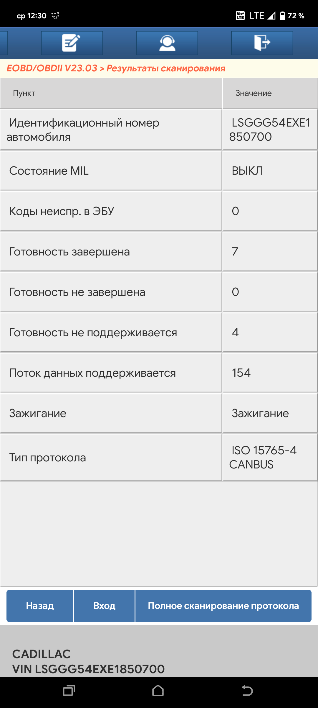

# Инструкция по активации приборов Mucar, Thinkdiag, Thinkcar 🔧

## Введение 📚

:::caution Внимание
Для выполнения всех последующих действий важно, чтобы у вас был доступ к автомобилю с разъемом OBD2 с питанием **12 вольт** и **выход в интернет**.
:::

## Шаг 1: Установка программы

1. **Скачивание программы**:
   Перейдите по [ссылке №1](https://i.getspace.us/cloud/s/fAMr3QsBMekwR2n) или [ссылке №2](https://nch.pl/s/T6c4C7Gj5Me3mGF) и загрузите программу, соответствующую вашей подписке.

:::note Примечание
Вы всегда можете скачать актуальную версию программы Diagzone с официального сайта по [этой ссылке](https://diagzone.com/get-apk).
:::

2. **Установка приложения**:
   Установите приложение на ваше устройство.

:::caution Внимание
Часто система Android предупреждает об угрозах при установке. В этом случае нужно нажать "ПОДРОБНЕЕ" и далее "ВСЕ РАВНО УСТАНОВИТЬ". Далее при первом запуске приложения разрешите все права, иначе приложение не запустится корректно.
:::

## Шаг 2: Вход в программу

1. **Запуск программы**:
   Запустите программу на вашем устройстве.

2. **Вход в аккаунт**:
   В правом верхнем углу экрана нажмите на кнопку "Логин".

3. **Ввод данных**:
   Введите следующие данные для входа:
   - Имя пользователя: серийный номер адаптера (например: 989140760169)
   - Пароль: smartdiag

:::note Примечание
Если у вас прибор с подпиской ProDiag, то пароль мы высылаем отдельным сообщением.
:::

## Шаг 3: Обновление программного обеспечения

1. **Переход в меню обновления**:
   Перейдите в главное меню программы и выберите пункт "Обновление программного обеспечения".

2. **Выбор марки**:
   Дождитесь загрузки списка доступных марок. Выберите марку "EOBD" (отметьте галочкой) и нажмите кнопку "Обновить одним нажатием" в правом нижнем углу.

3. **Начало проверки**:
   Удостоверьтесь, что ваш прибор подключен к автомобилю и успешно сопряжен с вашим устройством по Bluetooth. Начните процесс загрузки и дождитесь завершения установки.

:::warning Внимание
Если возникает зависание приложения при активации прибора Thinkdiag при нажатии на кнопку "Начать проверку" (вечная "Идет загрузка..." или "Ошибка! Обратитесь к дилеру"), выполните следующие шаги:
1. Отключите питание от прибора и держите его отключенным не менее 60 секунд.
2. Полностью очистите данные приложения.
3. Включите режим полета на вашем устройстве на 60 секунд для изменения IP-адреса.
4. Затем повторно запустите приложение, войдите в свой аккаунт и повторите процедуру проверки.
5. Попробуйте выполнить данную операцию с использованием VPN. Учитывая текущую обстановку в стране, доступ к серверам в некоторых регионах может быть ограничен.
:::

## Шаг 4: Локальная диагностика

1. **Возврат в главное меню**:
   Вернитесь в главное меню приложения.

2. **Выбор марки для диагностики**:
   В разделе "Локальная диагностика" выберите марку EOBD. Подтвердите свой выбор, нажав на кнопку "Подтвердить" в правом нижнем углу экрана.

:::note Примечание
Перед началом диагностики необходимо включить зажигание в автомобиле.
:::

## Шаг 5: Отправка данных для активации

Ниже представлен пример скриншота, демонстрирующий необходимые данные, которые вам необходимо отправить в чат с нашим сотрудником для дальнейшей активации вашего устройства на сервере. После получения нами скриншота с результатами сканирования, полученного в результате подключения прибора, мы сможем активировать вашу подписку. Мы сообщим вам о её активации. После этого вы сможете перейти к шагу 3, скачать необходимые марки и сервисные функции, и начать их использование.

:::info Информация

Скриншот, демонстрирующий успешный запуск марки EOBD на примере программы Diagzone Pro (остальные программы работают аналогично).
:::

:::warning Важное замечание
Пожалуйста, обратите внимание, что только при подписке на Diagzone сохраняется доступ к серверу для скачивания марок и сервисных функций после истечения срока действия подписки. Эта уникальная возможность недоступна при использовании любых других подписок, таких как ProDiag, X-DIAG.
После окончания срока действия подписки, у вас не будет возможности скачать все ваши марки и сервисные функции. Однако прибор продолжит полноценную работу (за исключением онлайн доступа). С учетом этого, настоятельно рекомендуем сохранить все ваши марки ближе к окончанию срока действия подписки, например, на флеш-носитель. Это обеспечит возможность переноса их на другой телефон или планшет в случае необходимости после окончания срока действия подписки.
:::
