# Инструкция по работе с программой 📚

## Введение 📚

В этом мануале мы рассмотрим основные функции программы "Вася". В главном меню вы найдете три основные кнопки, с которыми вы чаще всего будете работать: "Список блоков управления", "Поиск неисправностей" и "Сервисные интервалы".

## Главное меню 🔧

### Список блоков управления

С помощью кнопки "Список блоков управления" мы получаем доступ ко всем блокам управления, установленным в автомобиле.

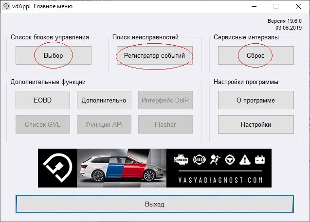

При нажатии на кнопку "Выбор" под этой надписью, открывается окно с несколькими вкладками.

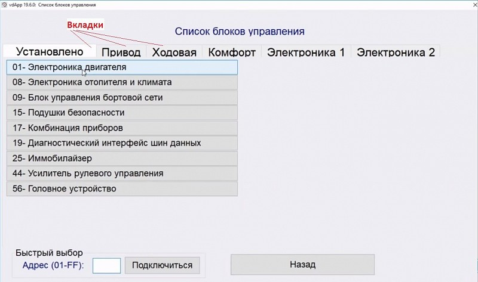

По умолчанию, активна вкладка "Установлено", где представлен список блоков управления, действительно присутствующих в подключённом автомобиле. Помимо вкладки "Установлено", здесь также присутствуют другие вкладки с различными блоками управления. Переключаясь между ними, вы сможете увидеть огромное количество блоков, с которыми может работать программа.

### Быстрый выбор

Обратите внимание на надпись "Быстрый выбор" в нижнем левом углу. В этом поле вы можете ввести номер блока управления, который хотите открыть. Это особенно удобно, когда нет необходимости искать нужный блок в огромном списке: достаточно ввести его номер и нажать кнопку "Подключиться".

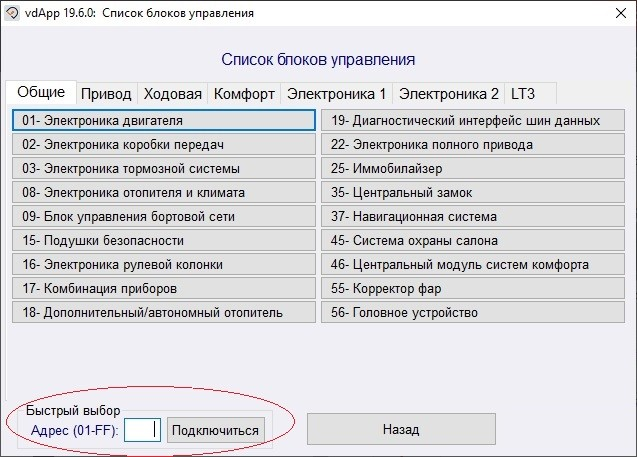

Например, нас интересует блок "Корректор фар", его номер - "55". Введите эту цифру в поле "Быстрый набор" и нажмите кнопку "Подключиться", программа автоматически найдет и откроет для вас этот блок.

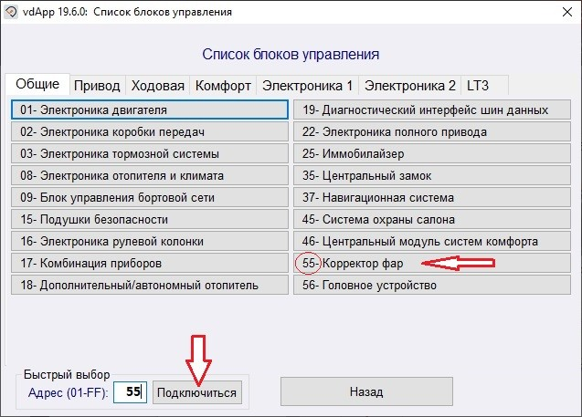

## Поиск неисправностей 🔍

Переходим с главного меню к разделу «Поиск неисправностей». Здесь вы сможете легко обнаруживать и устранять неисправности в памяти ЭБУ. Просто нажмите кнопку «Выполнить» и дождитесь, пока программа просканирует все блоки.

По окончании диагностики, в пустом поле появится список блоков. Если блоки исправны, они будут отмечены чёрным цветом, а если в них есть ошибки — красным. Если в каком-то из блоков обнаружена ошибка, программа предоставит подробное описание проблемы и указание на его код.

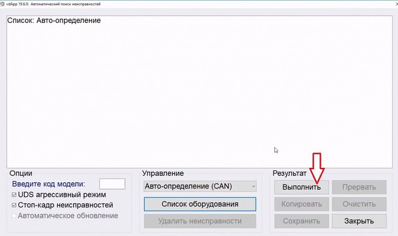

Для удобства вы можете скопировать текст отчёта в буфер обмена с помощью кнопки «Копировать», а также сохранить отчёт на компьютере с помощью кнопки «Сохранить» и распечатать его.

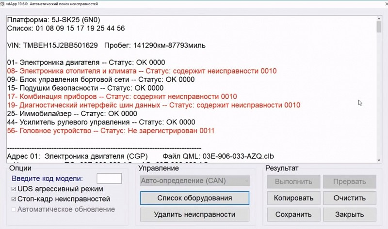

Если вы хотите устранить неисправности, выделенные красным цветом, просто нажмите кнопку «Удалить неисправности». Это позволит очистить память ЭБУ от ошибок.

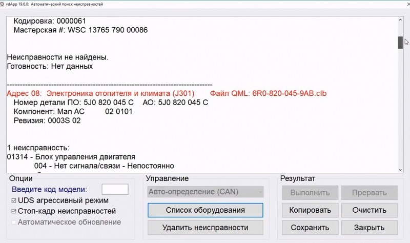

## Сервисные интервалы 🕒

Кнопка "Сервисные интервалы" предоставляет удобную возможность просматривать и сбрасывать сервисные интервалы вашего автомобиля. Для того чтобы сбросить интервалы, просто нажмите на кнопку "Сброс" в главном меню. При этом программа автоматически считывает все показания с панели приборов и выводит их в виде удобного списка с указанием пробега для каждого интервала.

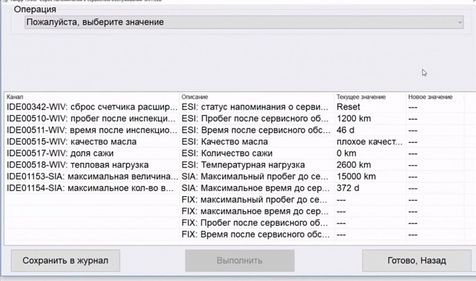

Кроме того, нажав на кнопку с надписью «Операция», откроется небольшой список действий, доступных в данный момент. Например, вы сможете сбросить сервисный интервал по замене масла. Когда вы выберете этот параметр и нажмёте кнопку «Выполнить», интервал обнулится.

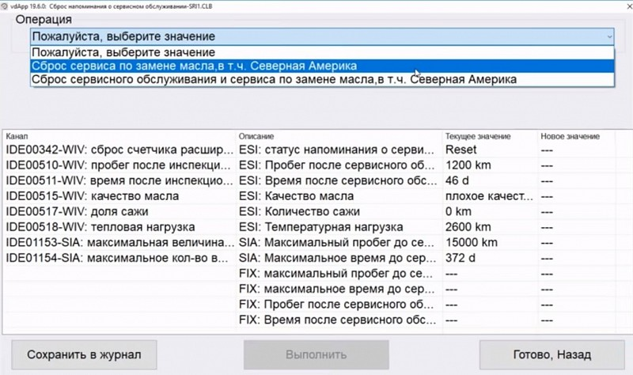

## Дополнительные функции 🔧

Помимо трёх основных кнопок, в программе также доступен раздел «Дополнительные функции». Одна из этих кнопок называется «EOBD» и предполагает работу с ЭБУ, с поддержкой OBD II. Однако для автомобилей VAG эта кнопка не столь полезна, поскольку вместо использования урезанного протокола связи с ЭБУ через режим EOBD, рекомендуется использовать полноценный протокол через основные блоки управления.

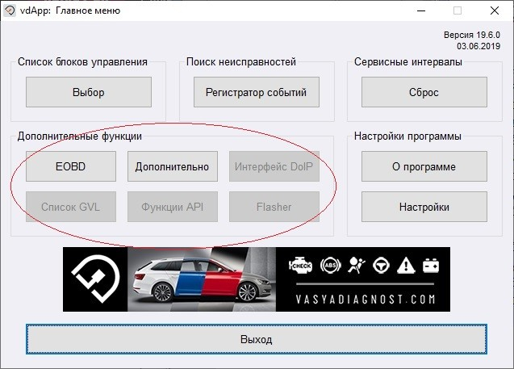

Далее следует кнопка "Дополнительно", при клике на которую открывается ещё один список возможностей сканера. Это позволяет активировать и деактивировать транспортный режим. Кнопка "Карта каналов блока адаптаций" предоставляет возможность сохранять считываемые значения настроек и адаптаций в отдельный файл. Ещё одна полезная функция - кнопка "EDC15-16 пробег", которая позволяет считать реальный пробег автомобиля.

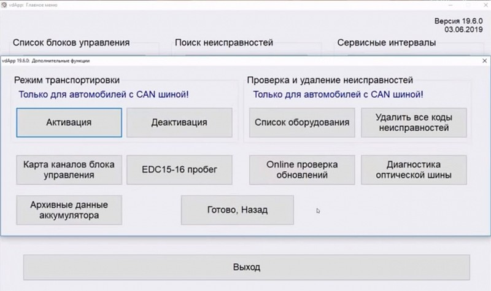

## Структура меню блоков управления 📂

Теперь давайте более подробно рассмотрим структуру меню блоков управления. Для начала, перейдем в список блоков управления, и для иллюстрации примера, мы откроем блок «Электроника двигателя».

### Базовые функции 🔧

В результате открытия этого блока, появится окно с полными данными об этом блоке, расположенными в полях. Кроме того, в правом верхнем углу окна будет указан протокол, с помощью которого программа установила соединение с данным блоком.

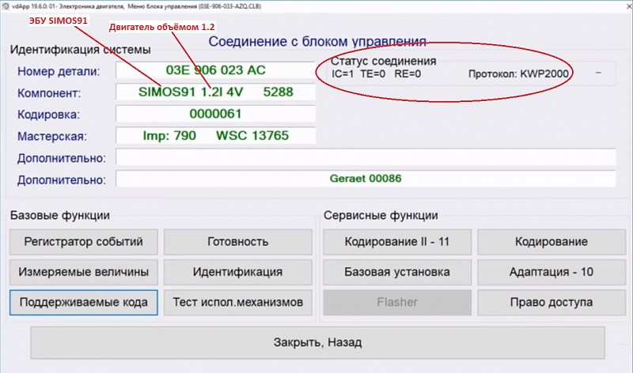

В нижней части окна размещаются два блока с по шестью кнопками: «Базовые функции» и «Сервисные функции».

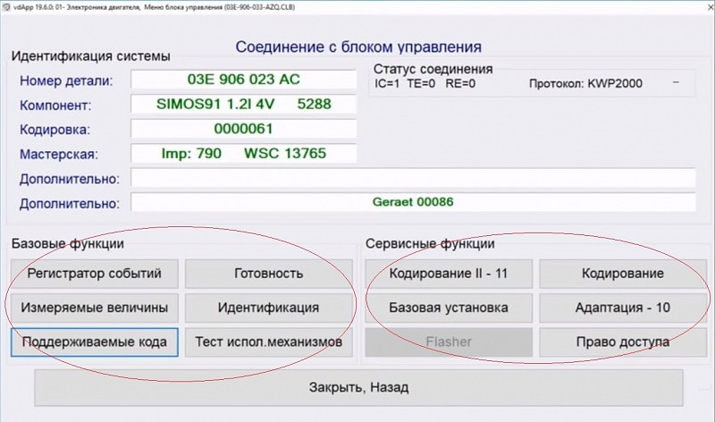

#### Регистратор событий

Первая кнопка - 'Регистратор событий'. Это не что иное, как сканирование неисправностей, доступное из главного меню. В данной вкладке будут отображаться только ошибки, связанные с текущим блоком управления, а не со всеми установленными на автомобиле.

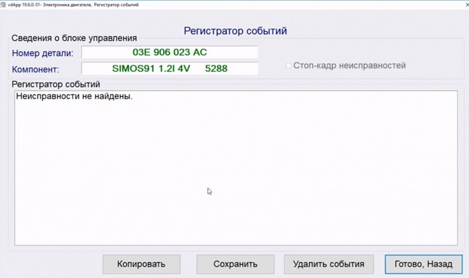

#### Измеряемые величины

Следующая кнопка - 'Измеряемые величины'. Она позволяет отслеживать параметры автомобиля в реальном времени. Например, с её помощью можно узнать обороты двигателя на холостом ходу при заведенном моторе. Каждая группа содержит 4 параметра, которые отображаются в пустых полях.

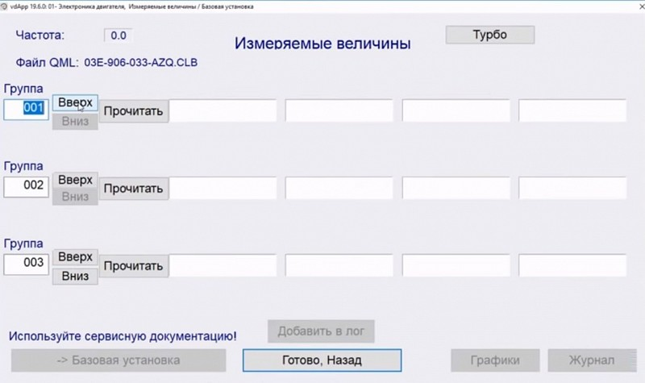

#### Готовность

Следующая кнопка называется «Готовность» и представляет собой очень полезную функцию базовых возможностей. Она позволяет просматривать параметры, которые мониторятся блоком управления.

#### Идентификация

Следующая кнопка называется «Идентификация», и она содержит всю информацию о блоке управления двигателем.

#### Тест исполнительных механизмов

«Тест исполнительных механизмов» предоставляет возможность безопасно проверить работу всех исполнительных механизмов автомобиля и убедиться в их правильной функциональности.

## Сервисные функции 🛠️

Теперь давайте подробнее рассмотрим небезопасные, но мощные сервисные функции автомобиля, которые требуют особой осторожности в использовании.

### Кодирование

Первая и, пожалуй, самая важная из них - кнопка «Кодирование II - 11». При нажатии на нее откроется окно, где можно будет изменить кодировку блока. Это своего рода специальная настройка блока, которая позволит нам включать или отключать различные функции автомобиля, используя определенные коды.

### Базовая установка

Следующая кнопка предоставляет сервисные функции и называется "Базовая установка". Интерфейс этой кнопки очень похож на интерфейс кнопки "Измеряемые параметры", за исключением того, что раздел "Базовая установка" предоставляет не только контроль параметров в реальном времени, но и дополнительные действия.

### Адаптация

Следующая кнопка - "Адаптация". Здесь вы обнаружите множество интересных функций, которые можно активировать, выбрав соответствующий параметр в контекстном меню.

### Право доступа

И последняя немаловажная кнопка - "Право доступа". Прежде чем вносить изменения в кодировки или проводить адаптации, необходимо авторизоваться. В этом нам поможет как раз такая кнопка. Кликнув на неё, вам потребуется ввести специальный код. После этого блок управления откроет доступ к кодировкам и позволит вносить необходимые изменения.

## Заключение 🏁

Наше знакомство с программой "Вася" подошло к концу, и мы уверены, что у вас теперь сложилась более ясная картина. При выполнении первой самостоятельной работы вы будете чувствовать себя намного увереннее. Важно не забывать, что практика - залог успеха. Так что продолжайте практиковаться и совершенствоваться. Успехов вам!

---
