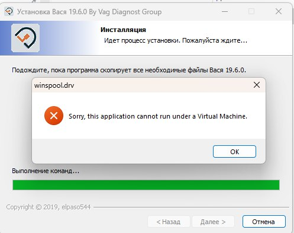
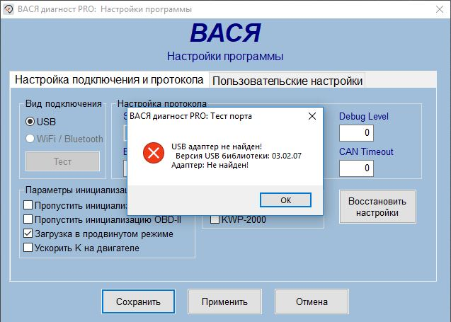
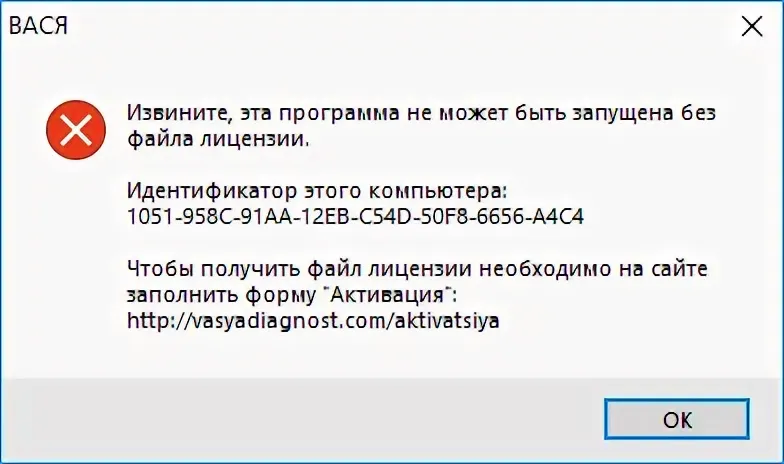

# Часто задаваемые вопросы (FAQ) ❓

## Откуда скачать программу? 💻

Вы можете скачать необходимое программное обеспечение вместе с подробной инструкцией по установке на нашем официальном веб-сайте. Перейдите в раздел **Программы -> Марочные -> VCDS/Вася** и нажмите кнопку **Скачать**.

## Ошибка при открытии архива 📦

Если возникает ошибка при открытии скачанного архива с программой, это может быть вызвано несколькими причинами:

1. **Антивирусное ПО**: Антивирус может блокировать запуск файла архива. Проверьте настройки антивирусной программы и убедитесь, что она не блокирует открытие архива.
2. **Устаревшая версия программы для разархивации**: Убедитесь, что у вас установлена последняя версия программы для разархивации архивов, например, WinRAR или WinZip.
3. **Яндекс Браузер**: Если вы используете Яндекс Браузер, отключите функцию проверки безопасности для скачиваемых файлов. Для этого зайдите в настройки браузера, перейдите на вкладку "Безопасность" и снимите галочку с опции "Проверять безопасность посещаемых сайтов и загружаемых файлов".
4. **Повторное скачивание**: Если причина не в антивирусной программе и у вас установлена актуальная версия программы для разархивации, попробуйте повторно скачать архив и убедитесь, что он был загружен полностью 🔄.

## Ошибка Virtual machine 🖥️

1. Установка программы на виртуальную машину не поддерживается.

2. Данная ошибка может возникать на операционных системах Windows 10 и Windows 11 из-за включенной по умолчанию виртуализации системы. В зависимости от вашей операционной системы, следуйте инструкциям по отключению данной функции:

- [Инструкция для Windows 10](https://lumpics.ru/how-to-disable-hyper-v-in-windows-10/)
- [Инструкция для Windows 11](https://lumpics.ru/how-disable-hyper-v-in-windows-11)

:::note Примечание
Следует отметить, что в каждой инструкции представлено несколько вариантов отключения. Если первый вариант не помог, переходите к другому.
:::

## Ошибка теста прибора 🛠️

Для решения данной проблемы, возникшей из-за отсутствия или неправильной установки драйвера устройства, следуйте этим шагам:
1. Перейдите на наш сайт и проследуйте инструкциям для загрузки версии программы **Вася 19.6** и двух драйверов: **"01.01 - Universal Drivers"** и **"01.02 - Вася Diagnoст"**, доступных в разделе скачивания нашего облачного сервиса.
2. Перед установкой программы, необходимо временно отключить антивирусное программное обеспечение, включая стандартный защитник Windows. После завершения установки, добавьте приложение в исключения вашего антивируса.

:::caution Внимание
Если интерфейс не распознается (неизвестное устройство), значит драйвер не установился. Нужно отключить проверку цифровой подписи драйверов Windows, а затем установить драйверы вручную повторно: файлы «01.01 - Drivers Universal» и «01.02 - Drivers Вася».
:::

### Инструкции по отключению проверки цифровой подписи драйверов для разных версий Windows:

#### Windows 10:
1. Перейдите в "Параметры" > "Обновление и безопасность" > "Восстановление".
2. В разделе "Особые варианты загрузки" нажмите "Перезагрузить сейчас".
3. После перезагрузки выберите "Устранение неполадок" > "Дополнительные параметры" > "Параметры загрузки".
4. Нажмите "Перезагрузить" и затем нажмите клавишу **F7** для отключения проверки цифровой подписи драйверов.

:::tip Рекомендация
Подробная инструкция доступна [здесь](https://remontka.pro/disable-drivers-signature-check-windows-10/).
:::

#### Windows 8 и 8.1:
1. Перейдите в "Параметры" > "Изменение параметров ПК" > "Обновление и восстановление" > "Восстановление".
2. В разделе "Особые варианты загрузки" нажмите "Перезагрузить сейчас".
3. После перезагрузки выберите "Устранение неполадок" > "Дополнительные параметры" > "Параметры загрузки".
4. Нажмите "Перезагрузить" и затем нажмите клавишу **F7** для отключения проверки цифровой подписи драйверов.

:::tip Рекомендация
Подробная инструкция доступна [здесь](https://winitpro.ru/index.php/2013/01/17/ustanovka-nepodpisannogo-drajvera-v-windows-8/).
:::

#### Windows 7:
1. Перезагрузите компьютер и нажмите **F8** до появления логотипа Windows.
2. В меню "Дополнительные варианты загрузки" выберите "Отключить обязательную проверку подписи драйверов".
3. Нажмите **Enter** и перезагрузите компьютер.

:::tip Рекомендация
Подробная инструкция доступна [здесь](https://ittips.ru/otklucit-proverku-cifrovoj-podpisi-drajverov-windows-10.html).
:::

После отключения проверки цифровой подписи драйверов, установите драйверы вручную повторно: файлы «01.01 - Drivers Universal» и «01.02 - Drivers Вася».

## "Программа устарела" 🆕

🆕 С 2024 года при запуске программы у пользователей начало появляться сообщение, что **"программа устарела"**. В настоящее время обновлений нет, но вы можете продолжить полноценное использование программы, закрыв это окно. Это сообщение не влияет на функциональность программы. Пожалуйста, следите за обновлениями на нашем сайте. Мы сообщим вам, как только появится новая версия. Если вы хотите избежать появления данного окна, вы можете изменить дату на вашем компьютере на 2023 год.

## Ошибка файла лицензии 🔐

Эта ошибка возникает из-за неправильной установки программы. Перед установкой необходимо отключить все антивирусы на компьютере, включая **встроенный антивирус Windows** и **брандмауэр**. Затем после установки добавьте программу в исключения вашего антивируса (если он есть) и Windows Defender. Если этого не сделать, то файл лицензии удаляется.

Для решения проблемы необходимо полностью удалить программу с компьютера (рекомендуем использовать программу **Revo Uninstaller**). Затем установите программу заново, следуя инструкциям на нашем сайте. Чтобы полностью удалить программу, включая все записи из реестра, рекомендуется использовать программу [Revo Uninstaller](https://www.revouninstaller.com). Просто скачайте портативную версию с их сайта, запустите программу и воспользуйтесь режимом "Охотник" для удаления приложения вместе с его данными.
