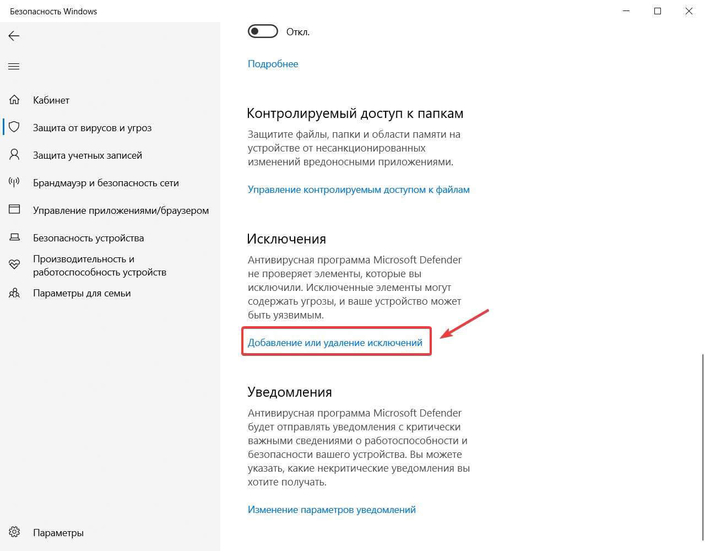

# Инструкция по установке 📝

## Введение 🛠️

Мы разработали данную инструкцию, чтобы обеспечить максимальный комфорт и успешность в установке приложения. Чтобы избежать возможных проблем, пожалуйста, внимательно следуйте всем пунктам инструкции.

:::caution Внимание
Все упоминаемые здесь папки и файлы находятся в папке "01 - Вася".
:::

Прибор изначально прошит под использование VCDS + Вася, т.е. можно параллельно с VCDS установить и Вася, но тогда проблемы от VCDS могут сохраниться и у Вася. Если же шнур изначально прошит под Вася, то он будет работать только с Вася - это наиболее стабильная сборка.

:::tip Рекомендация
**Рекомендуем прошить прибор под «ВАСЯ» и использовать программу «ВАСЯ».**
:::

## Подготовка к установке 🔧

Если у вас установлен антивирус или активен брандмауэр, перед установкой их необходимо перевести в неактивный режим (не выключать совсем, а отключить защиту). После установки программы нужно добавить всю папку с программой в доверенные программы в антивирусе. Затем работу антивируса можно восстановить. Отключите **ВСЕ** антивирусы, в том числе и стандартный **Защитник Windows**.

### Отключение стандартного защитника Windows 🔧

**Что нужно:**
1. Зайдите в Параметры.
2. Перейдите в Безопасность Windows.
3. Отключите ползунки так, как показано на скриншоте.

Если у вас есть сторонние антивирусы, то их тоже нужно отключить.

### Отключение брандмауэра 🔒

На время установки следует отключить брандмауэр Защитника Windows.

**Что нужно:**
1. Откройте Панель управления.
2. Откройте Брандмауэр Защитника Windows.
3. Сделайте все, как показано на скриншоте, и нажмите Ok.

## Установка программы 💻

1. Установите универсальный драйвер «01.01 - Drivers Universal» и «01.02 - Drivers Вася» из папки "01 - Вася".
2. Установите «01 - Install.exe» из папки «01.01 - Вася - 19.6».

:::caution Внимание
3. Добавьте папку с установленной программой в исключения вашего антивируса (если он есть) и в исключения Защитника Windows!
:::

4. Запустите программу с помощью ярлыка на рабочем столе. Ни в коем случае не обновляйте программу в автоматическом режиме - в системе заблокируется лицензионный номер шнура!
5. Подключите шнур к ноутбуку.
6. Подключите шнур к автомобилю.
7. Включите зажигание.
8. Зайдите в настройки программы и выполните **TECT** соединения. После удачного соединения нажмите кнопку **«Сохранить»**.

## Если что-то пошло не так 🛠️

1. **Интерфейс не распознается (неизвестное устройство):**
   - Драйвер не установился. Нужно отключить проверку цифровой подписи драйверов Windows, а затем установить драйверы вручную повторно: файлы «01.01 - Drivers Universal» и «01.02 - Drivers Вася».

2. **Ошибка по неготовности CAN при тесте интерфейса:**
   - Нажмите «Сохранить» даже в таком статусе.
   - Закройте программу и отключите шнур полностью.
   - Подключите шнур снова, запустите программу и проведите тест еще раз.
   - Нажмите «Сохранить» - после этого все должно заработать.

:::note Примечание
Если у вас старое авто и/или отсутствует или не работает CAN, то это нормально, если статус готовности CAN будет отрицательным.
:::
