# Установка Wurth WoW 5.00.8R2 📝

## Распаковка архива 📦

1. Распакуйте файл **wowR2rus.exe** из архива в корень диска **C:/**. (Важно распаковать именно в корень диска C).
2. Запустите файл и нажмите **Извлечь**. Пароль для архива - **motordig**.
3. В результате у вас появится папка **C:/wowR2rus**. Откройте папку **wowR2rus** и запустите файл **wow.exe**.

## Установка программы 💻

1. Нажмите кнопку **ДАЛЬШЕ**.


2. В следующем окне также нажмите **ДАЛЬШЕ**.

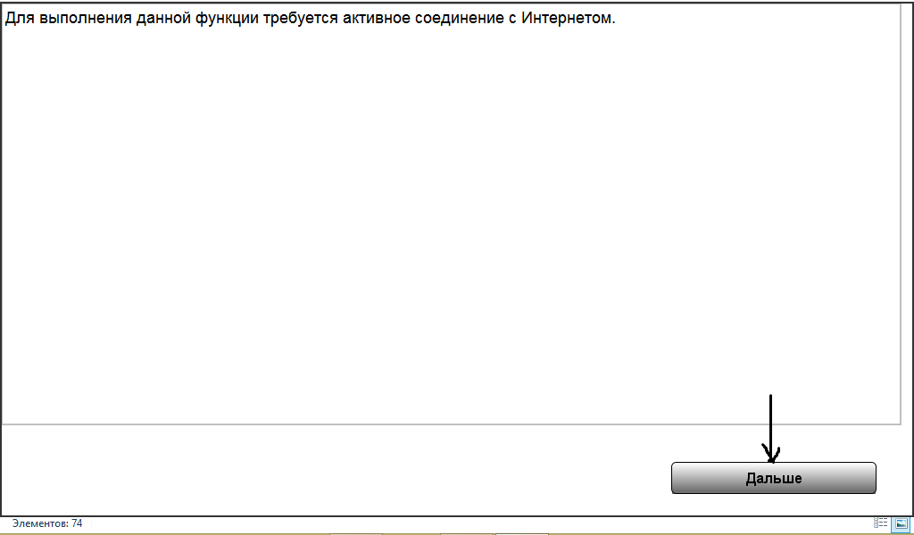

3. Заполните окно **«данные клиента»**. Номер клиента не изменять!

:::note Примечание
Рекомендуется заполнить данные как указано. Нажмите **ДАЛЬШЕ**.
:::

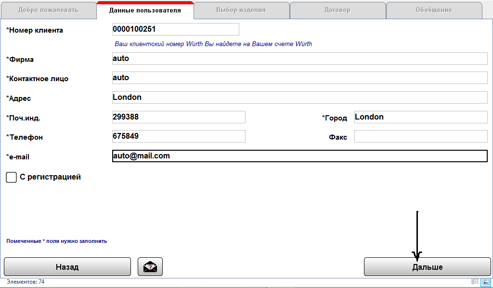

4. В окне **ВЫБОР ИЗДЕЛИЯ** выберите ключ **«Diagnose Seriell S-light»** и нажмите **ДАЛЬШЕ**. Этот ключ останется в затребованных.

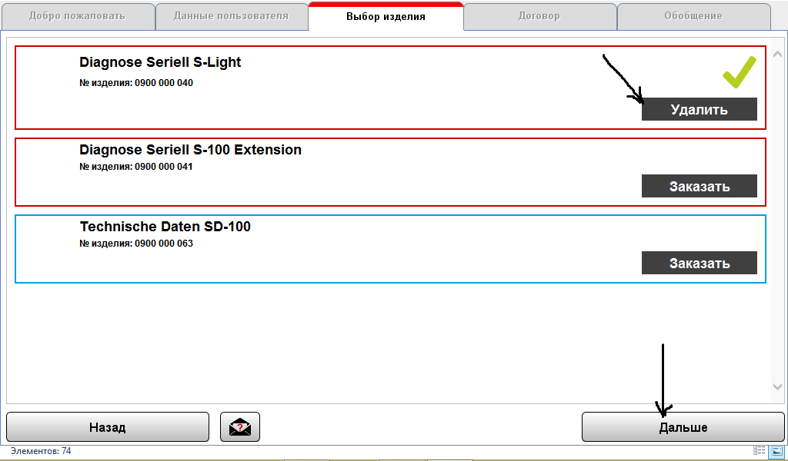

5. В окне **«ДОГОВОР»** поставьте галочку **«АКЦЕПТИРОВАТЬ»** и нажмите **ДАЛЬШЕ**.

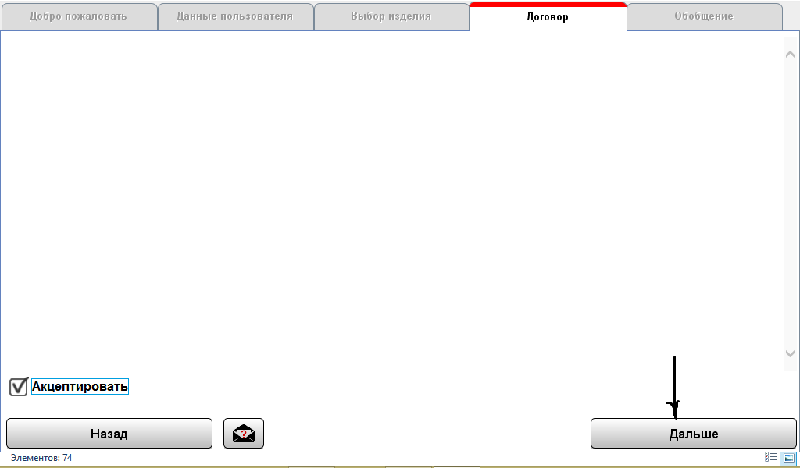

6. В окне **«ОБОБЩЕНИЕ»** нажмите **«ЗАКАЗАТЬ»**.

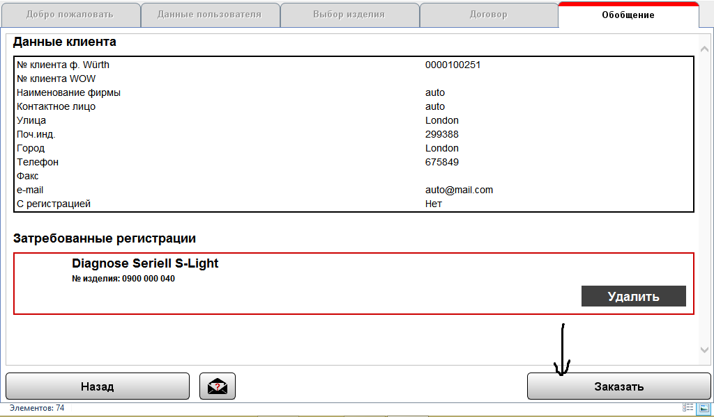

7. В окне **«Предварительный просмотр распечатки»** нажмите **ЗАКРЫТЬ**.

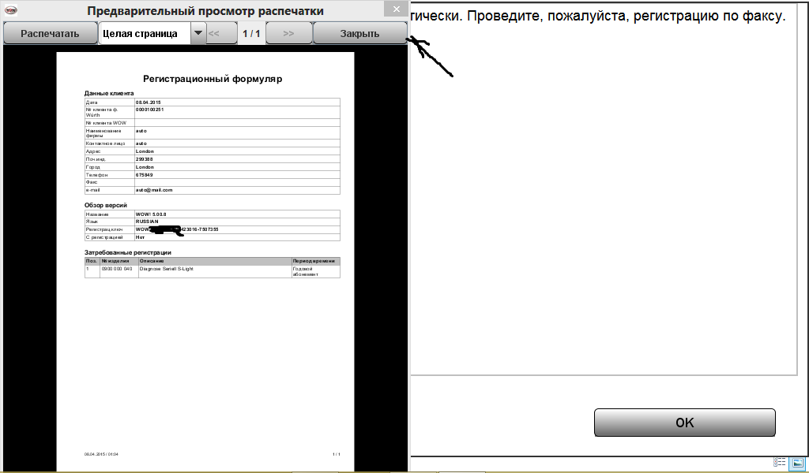

8. Нажмите **ОК**.

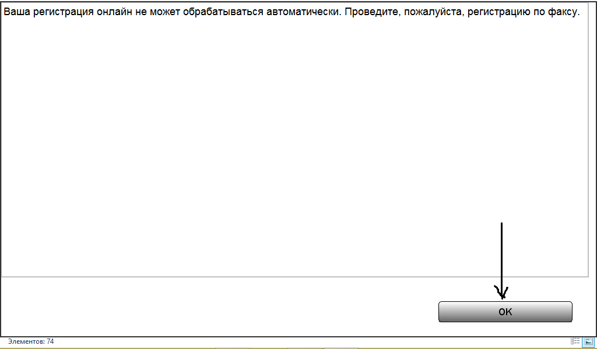

9. Вы попадаете в окно **СОСТОЯНИЕ РЕГИСТРАЦИИ**. Внимательно проверьте ваш **Регистрационный ключ**.

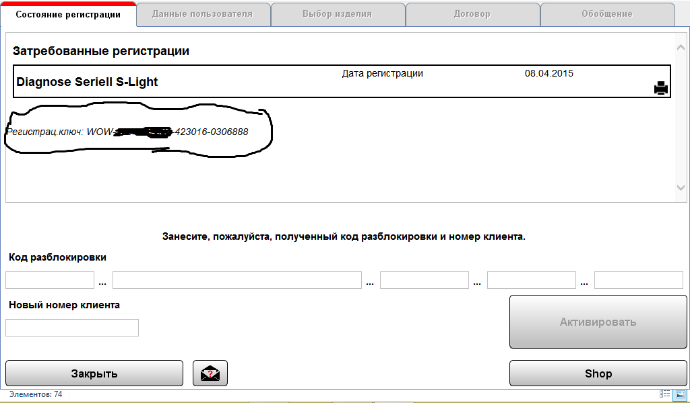

## Активация ключей 🔑

1. Для определения необходимых цифр для активации запустите **KEYGEN** (keygen.exe). Введите ваш ключ, выберите **WoW! Pro** и нажмите **Calculate**. В примере это цифры **27** и **86**.

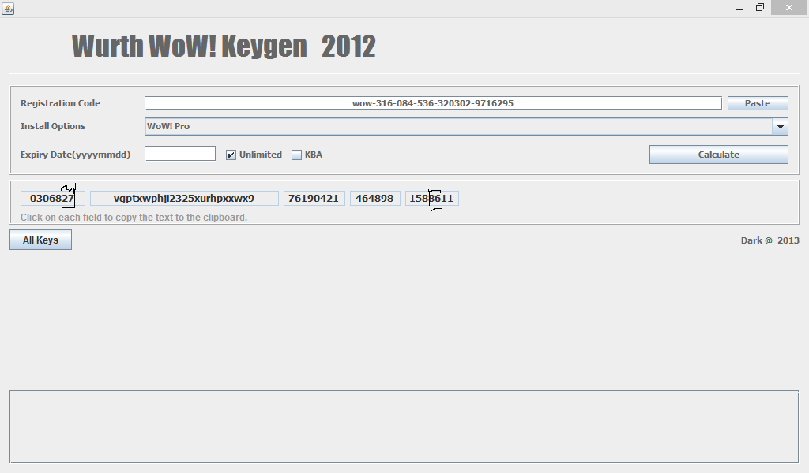

2. Далее активируйте следующие ключи:

```
03068XX-22222o22qi232252rhpxxwx2-76190421-464898-138XX10
```
```
03068XX-225lxwphvi2222hq22222224-76190421-464898-168XX12
```
```
03068XX-vgma2w22qi2225l622222227-76190421-464898-138XX19
```
```
03068XX-3i222222222222i422222222-76190421-464898-158XX19
```

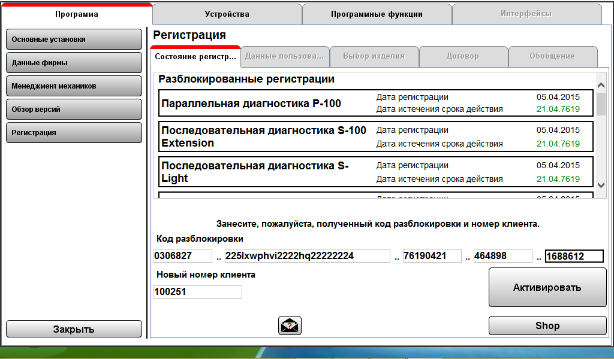

:::caution Внимание
Активировать другие ключи без наличия спецоборудования и реальной лицензии не имеет смысла и может ухудшить работу программы. При активации номер клиента оставьте **100251**.
:::

3. После активации нажмите **ЗАКРЫТЬ**.

4. Перед запуском программы откройте файл **C:/wowR2rus/ac_diagnosis_module/data/serial_numbers.txt**. Проверьте, записан ли ваш **S/N номер прибора**. Если нет, то запишите его.

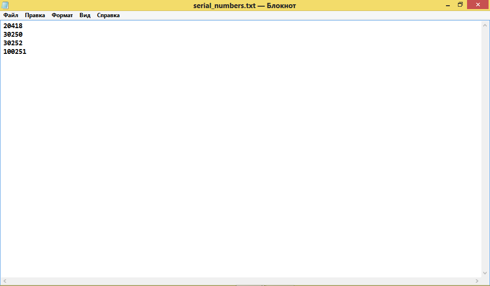

Ваша программа готова к работе. В папке **C:/wowR2rus/data** находится папка **NEW** - это чистые **REG** файлы.
