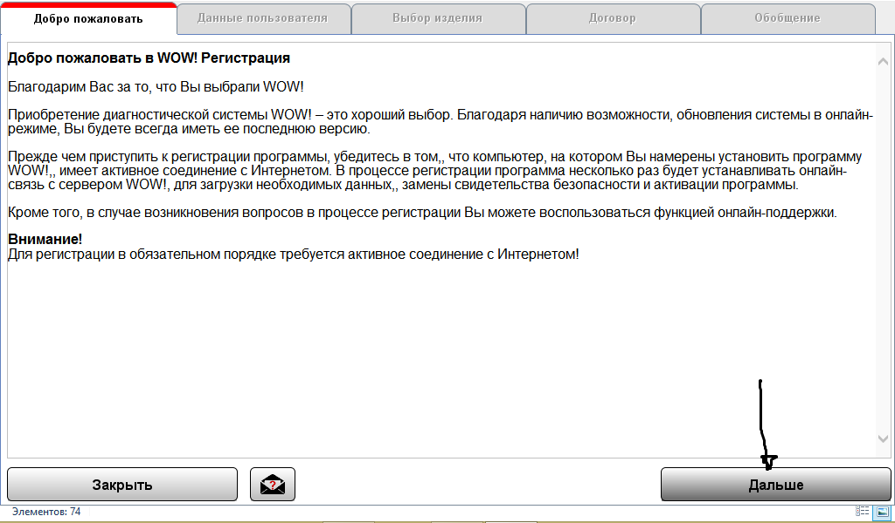

# Активация WOW 5.00.8R2 📝

## Распаковка архива 📦

1. Распаковать файл **wowR2rus.exe** в корень диска **C/**. (Важно распаковать именно в корень диска C)
2. Запустить файл и нажать **Извлечь**. Пароль для архива - **motordig**.
3. У вас получится папка **C/wowR2rus**. Открываем папку **wowR2rus** и запускаем файл **wow.exe**.

## Установка программы 💻

1. Нажимаем кнопку **ДАЛЬШЕ**.

2. В следующем окне также жмем **ДАЛЬШЕ**.

   :::note Примечание
   Для выполнения данной функции требуется активное соединение с Интернетом.
   :::

3. Заполняем окно **«данные клиента»**. Номер клиента не изменять!

   Лучше заполните как указано. Жмем **ДАЛЬШЕ**.

4. В окне **ВЫБОР ИЗДЕЛИЯ** выбираем ключ **«Diagnose Seriell S-light»** и жмем **ДАЛЬШЕ**. Этот ключ у вас останется в затребованных.

5. В окне **«ДОГОВОР»** поставить галочку **«АКЦЕПТИРОВАТЬ»** и жмем **ДАЛЬШЕ**.

6. В окне **«ОБОБЩЕНИЕ»** жмем **«ЗАКАЗАТЬ»**.

7. В окне **«Предварительный просмотр распечатки»** жмем **ЗАКРЫТЬ**.

8. Жмем **ОК**.

   :::caution Внимание
   Ваша регистрация онлайн не может обрабатываться автоматически. Проведите, пожалуйста, регистрацию по факсу.
   :::

9. Мы попадаем в окно **СОСТОЯНИЕ РЕГИСТРАЦИИ**. Здесь внимательно смотрим ваш **Регистрационный ключ**.

10. Для определения необходимых цифр для активации запускаем **KEYGEN** (keygen.exe).

## Активация ключей 🔑

1. Вводим ваш регистрационный ключ и определяем необходимые цифры. На примере это цифры **27** и **86**.

2. Далее активируем следующие ключи:

   :::caution Внимание
   Активировать другие ключи без наличия спецоборудования и реальной лицензии не имеет смысла, даже может ухудшить работу программы. При активации номер клиента оставьте **100251**.
   :::

3. После активации жмем **ЗАКРЫТЬ**.

4. Перед запуском программы откроем файл **C/wowR2rus/ac_diagnosis_module/data/serial_numbers.txt**. Посмотрите, записан ли ваш **S/N номер прибора**. Если нет, то запишите.

Ваша программа готова к работе. В папке **C/wowR2rus/data** находится папка **NEW** - это чистые **REG** файлы.
